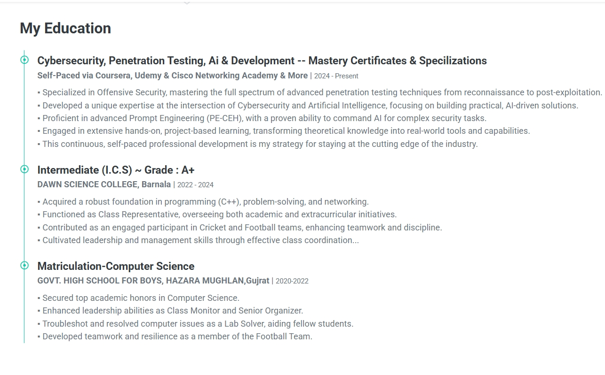
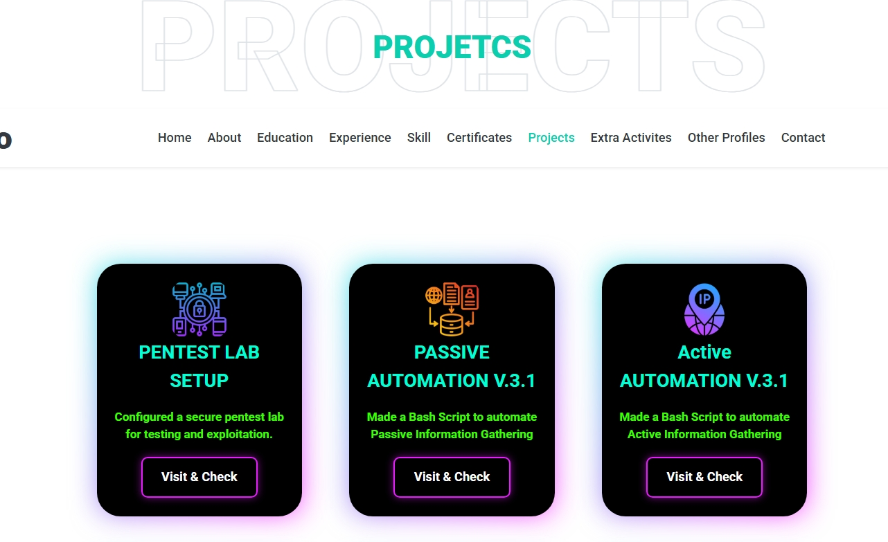
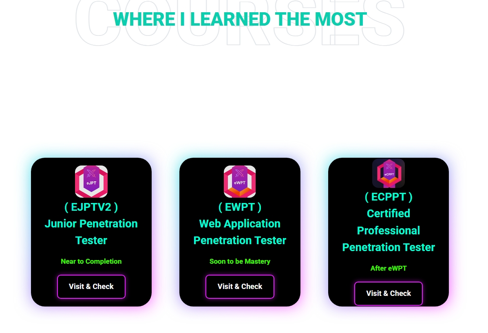
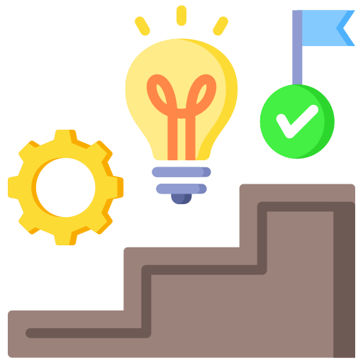
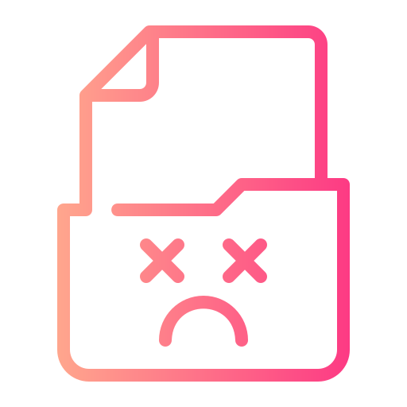
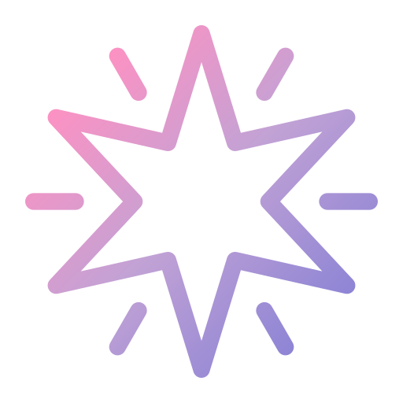
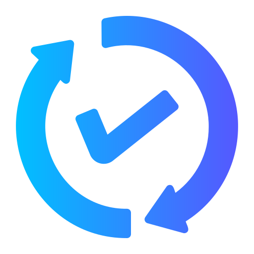
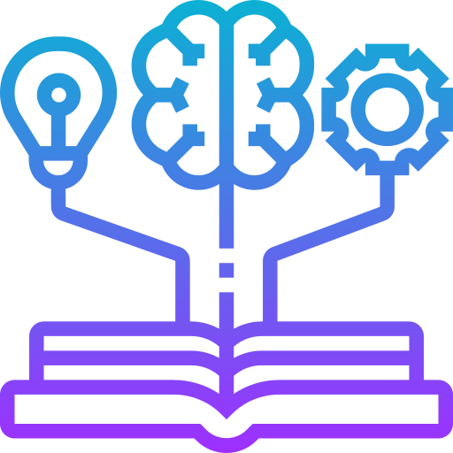

  
  

  

# **My-Portfolio – A Unique, Professional, and Fully Customized Portfolio Website**

Welcome to  **My-Portfolio** , a beautifully crafted and highly professional portfolio website that represents my  **skills, expertise, and achievements** .

This project  **started as a template** , but I took the challenge to **modify, enhance, and personalize it** to reflect my identity as a  **professional ethical hacker, cybersecurity enthusiast, and web developer** .

Every section has been  **refined, structured, and uniquely styled** , making this portfolio truly  **one-of-a-kind** .

🚀 **This is more than a portfolio; it’s a testament to my journey, challenges, and resilience.**

## **📌 Project Overview**

  
  

 

### 🔹 **Purpose of This Portfolio**

This portfolio is designed to:

* **Showcase my skills & expertise** in an interactive manner.
* **Highlight my projects, certifications, and professional journey.**
* **Provide potential clients & employers with an overview of my work.**
* **Offer an easy way to connect and collaborate.**

### 🔹 **Technologies Used**

* **HTML5** – For the website structure.
* **CSS3** – For styling and visual enhancements.
* **JavaScript** – For interactivity and smooth animations.
* **Bootstrap** – For responsive and modern UI design.
* **Font Awesome & Google Fonts** – For icons and typography.

## **💡 Features & Enhancements**

  
  

 

✔ **Fully Responsive Design** – Seamlessly adapts to all screen sizes.

✔ **Custom UI & Visuals** – Uniquely designed with a professional aesthetic.

✔ **Optimized Performance** – Fast loading time with clean, structured code.

✔ **Skills & Expertise Section** – A refined showcase of my skill set.

✔ **Projects Portfolio** – Displaying my work in an elegant layout.

✔ **Certifications & Courses Section** – Organizing my achievements effectively.

✔ **Dynamic Contact Form** – Fully functional and easy to use.

✔ **Enhanced Navigation** – Smooth scrolling and a user-friendly interface.

✔ **Bug Fixes & Code Refinement** – Clean, optimized, and well-documented code.

## **📸 Few Screenshots & Previews**

Here are some snapshots of my portfolio:

### 📍 **Header Section**

**Screenshot**: 

### 📍 **Education**

**Screenshot**: 

### 📍 **Projects Showcase**

**Screenshot**: 

### 📍 **Where I Learned the Most Practically**

**Screenshot**: 

### 📢 **Live Demo:**  [Portfolio](https://mizazhaider-ceh.github.io/My-Portfolio/)

## **📖 My Journey: Lessons, Struggles & Growth**

  
  

 

This project was  **more than just coding** —it was an experience that taught me  **patience, resilience, and problem-solving skills** .

### 🚀 **The Learning Experience**

During these  **three intense days** , I:

* **Mastered UI/UX customization** and enhanced design aesthetics.
* **Learned how to debug efficiently** and optimize performance.
* **Explored AI tools** for quick solutions to technical problems.
* **Understood the importance of clean and structured code.**
* **Developed resilience** in the face of unexpected setbacks.

> *"Success is not just about coding; it’s about overcoming challenges and evolving with each mistake."*

## ⚠ **A Major Mistake**

  
  

  

**📅 Date:** March 18, 2025

**⏰ Time:** 2:00 PM

Everything was going smoothly—until **I made a critical mistake that almost cost me two days of hard work.**

### **What Happened?** 

  
  

  

1. My **index.html and CSS files** were open in **VS Code** while I was finalizing the project.
2. I  **moved them to a new folder** , but some files didn’t transfer properly.
3. **I pressed Ctrl + Z** to undo the action—it seemed fine.
4. However, in the new folder, I saw a  **"Replace file?" pop-up** .
5. Without thinking,  **I clicked "Replace"** —and that was my **biggest mistake.**
6. **All my modifications were lost** —two full days of hard work **gone in seconds!**

## ✨ **A Miracle**

  
  

 

**⏰ Time:** 2:16 PM

### **The Recovery Process: How I Saved My Work**

  
  

 

🔥 At first,  **I panicked** —but I quickly **regained control** and looked for a solution:

✔ **Step 1:** I searched online and used AI to find file recovery options.

✔ **Step 2:** I tried  **file recovery software (Disk Drill)** , but it didn’t work.

✔ **Step 3:** I took a **10-minute break** to clear my mind.

✔ **Step 4:** I realized **my portfolio was still open in the browser!**

✔ **Step 5:** Using  **Inspect Element** , I copied the entire code from the browser.

✔ **Step 6:** I thanked **Allah** for this small miracle.

✔ **Step 7:** I took another **short rest** before restarting my work.

✔ **Step 8:** I  **rebuilt everything faster & better** , as I had already solved previous challenges before.

# 📢 **Final Thoughts & Reflections**

  
  

 

This journey of building my portfolio was much more than just a technical project—it was a true  **test of patience, problem-solving, and faith** .

🔹 **Starting with the Name of Allah** – When I accidentally overwrote my files, I felt like I had lost everything. But instead of giving up, I took a deep breath,  **prayed, and put my trust in Allah** . This gave me the strength to  **stay calm and think logically** .

🔹 **Never Lose Hope, Solutions Exist** – The moment I realized my mistake, I felt a wave of frustration. But within seconds, I reminded myself: **“There is always a way.”** I researched, sought help from AI, explored multiple recovery methods, and eventually found a way to retrieve my work.

🔹 **Take Breaks & Refresh Your Mind** – After  **Sehri and offering prayer** , I returned with a **clear mindset** and started rebuilding my project. This time, I worked faster and smarter because I remembered all the challenges and their solutions.

🔹 **Work Smart, Not Just Hard** – I initially worked  **from 8 PM to 2 PM non-stop** , which led to exhaustion and mistakes. I learned that **consistent effort with proper rest** is far more effective than blindly pushing forward.

🔹 **Always Keep Backups** – Losing my files taught me the importance of  **saving backups on GitHub, cloud storage, or external drives** . Now, I’ll never work without a backup plan!

🔹 **Faith, Effort & Strong Will Lead to Success** – Instead of staying discouraged, I trusted in  **Allah, my skills, and my determination** . And in the end,  **I built an even better version of my portfolio** —faster, smarter, and more polished.

💡 **Lesson for Everyone:** Mistakes and setbacks are part of life. But those who **trust Allah, believe in themselves, and keep trying** will always find success. **Alhamdulillah, I didn’t give up—and neither should you!** 🚀

### 🎉 **Finally, I Did It!** 🎉

After all the challenges, learning, and late-night coding sessions—**it's done!** 🚀

This portfolio is not just a website; it's a symbol of my **dedication, resilience, and passion** for technology.

I started this journey with a goal, faced unexpected hurdles, but never gave up. Now, I stand here with a  **fully customized, professional portfolio** —and this is just the beginning!

🔥 **A message to everyone:** No matter how tough the road gets, keep going, keep learning, and trust the process. Success follows those who refuse to quit.

  
  

  

### 🚀  Onward to new challenges, bigger projects, and endless learning!

## **📩 Contact & Connect**

🌐 **Portfolio:**  [Portfolio](https://mizazhaider-ceh.github.io/My-Portfolio/)

📧 **Email:** [mizazhaiderceh@gmail.com](mailto:mizazhaiderceh@gmail.com)

💼 **LinkedIn:** [Your LinkedIn](https://www.linkedin.com/in/muhammad-izaz-haider-091639314/)
